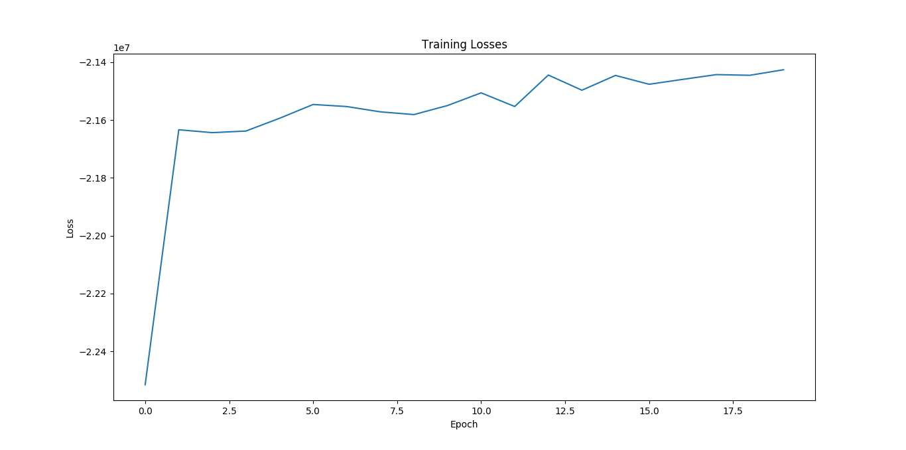

# Directory Structure
```text
.
├── embeddings
├── floyd_requirements.txt
├── floyd.yml
├── lehei.py
├── models
│   ├── embedding.py
│   ├── __init__.py
│   └── net.py
├── README.md
├── run.py
├── utils
│   ├── __init__.py
│   ├── model.py
│   └── plot.py
└── weights

4 directories, 11 files
```

# Command Line Interface
```text
usage: run.py [-h] --load LOAD

optional arguments:
  -h, --help   show this help message and exit
  --load LOAD  True: Load trained model False: Train model default: True

```

# Data - Wikipedia Data Sentences

```text
Use the Wikiextractor tool or
```
[Wikiextractor Tool](https://github.com/attardi/wikiextractor)
```text
Download from the Extra Section
```
[Data from Lazy Programmer](https://deeplearningcourses.com/c/natural-language-processing-with-deep-learning-in-python)

# Build the Word2Vec N-Gram Embedding with 1 Hidden Layer FeedForward network

## Embedding & Model Parameters
```text
vocab size: 1000
```
```text
hidden dim: 50
```
```text
input dim: vocab size
```
```text
output dim: vocab_size
```

## Training Parameters
```text
n-gram window size: 5
```
```text
learning rate: 0.025
```
```text
final learning rate:0.0001
```
```text
epochs: 20
```
```text
threshold: 0.00001 ( negative sampling distribution for word pruning / droping
```

## CLI
```shell
python run.py --load no
```

# Load N-Gram Word2Vec model
```shell
python run.py --load yes
```


# Experiment 1 - Word Nearest Neighbours
```text
So, We have 2 word embedding matrices and what do I do with them?
```
```text
Which one should I choose?
```

### Sub Experiment - Choose Input-To-Hidden Weight
## Word
```text
king
```
## Top 10 Nearest Neghbours with distances
|      |      son |    henry |    kings |   charles |   brother |   emperor |      iii |     pope |   daughter |
|:-----|---------:|---------:|---------:|----------:|----------:|----------:|---------:|---------:|-----------:|
| king | 0.164976 | 0.178694 | 0.191809 |  0.220155 |   0.22258 |  0.239958 | 0.259195 | 0.308814 |   0.323617 |

### Sub Experiment - Take the Average of two matrices
## Word
```text
king
```
## Top 10 Nearest Neghbours with distances
|      |      son |    kings |    henry |   brother |   charles |      iii |   emperor |   daughter |    louis |
|:-----|---------:|---------:|---------:|----------:|----------:|---------:|----------:|-----------:|---------:|
| king | 0.181043 | 0.182554 | 0.199096 |  0.226432 |  0.238195 | 0.248272 |  0.262365 |   0.352746 | 0.361133 |


# Expriment 2 - Word Analogy


```text
positive: world
```
```text
negative: city
```
```text
positive: population
```
```text
equation: world - city + population
```
```text
solution: estimated
```

# Training Procedure



# Under The Maintenance...

